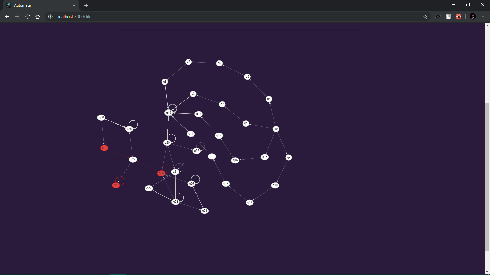
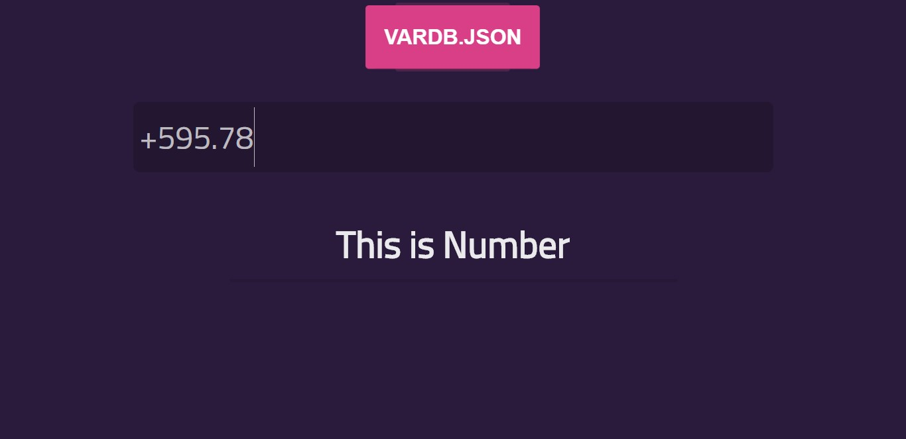
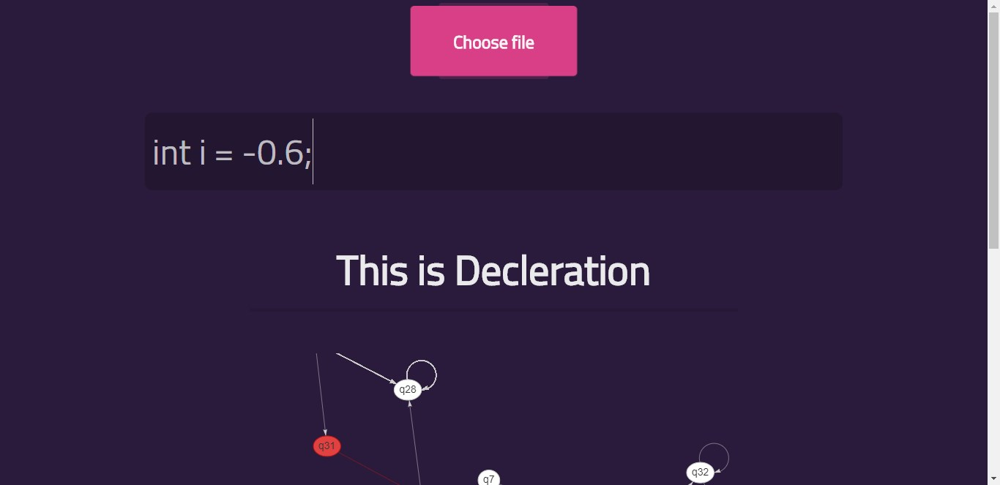
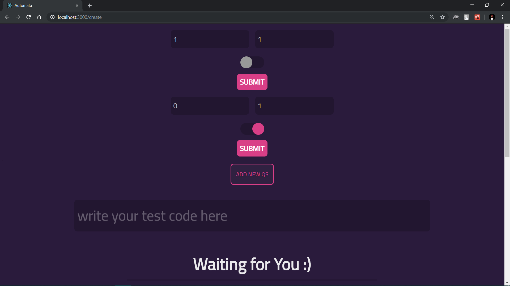

# Automata DFA ReactJS Project
we made this project to represent DFA Automata in ReactJS code with smooth, Real-time loading Graph which represents 
the corresponding automata 
## Screenshots:
Loading Automata from State ,test it and loading the corresponding graph example:

  

 Loading a certain Automata from JSON file:
 
  
  
  

 User Creating Automata statement:
 
  

## Authors:
* [Ammar Al-Helali](https://www.linkedin.com/in/ammar-al-helali-968803146/)
* [Riad Al-Najjar](https://www.linkedin.com/in/riad-al-najjar-53b267133/)
* [Kareem Dabbeet](https://www.linkedin.com/in/kareemda)
* [Moutasem Habboub](https://www.facebook.com/mmh1888)
# Built With:
* ReactJS 16.8
* NPM graph-vis
